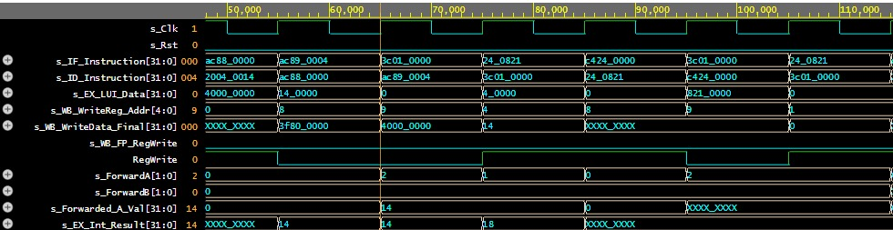
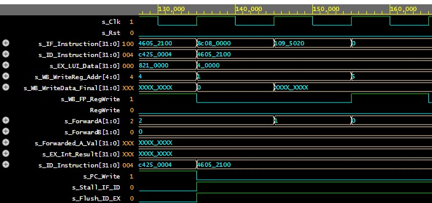
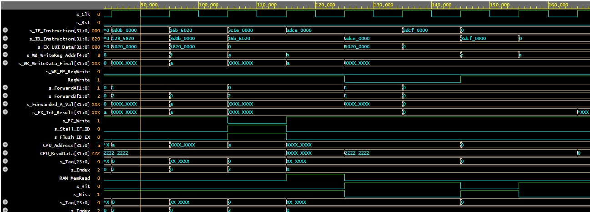

Desenvolvedores: Ezequias Kluyvert | Matheus Oliveira 
# MIPS-Processor

O projeto se trata do desenvolvimento do design de um **processador MIPS** com **pipeline de 5 estágios**, o objetivo foi evoluir um processador MIPS de ciclo único para essa nova arquitetura visando aumentar a vazão de instruções (throughput). Além disso, foram desenvolvidas unidades de controle de conflitos ***(Hazards)*** e um sistema de memória hierárquico com **Cache L1**.

- O projeto foi dividido em três fases principais:
   - Estruturação do Pipeline (Registradores de barreira).
   - Resolução de Hazards (Forwarding e Detecção de Stall).
   - Implementação de Memória Cache (Mapeamento Direto).

## Métodologia de Teste

### 🛠️ Instruções de Execução (EDA Playground)

Para validar o funcionamento completo do processador (Pipeline, Forwarding, Hazard Unit e Cache L1), utilizamos um **Testbench Mestre** (`tb_MIPS_Pipeline.vhd`) e um código de teste unificado.

Siga os passos abaixo para reproduzir a simulação:

### 1\. Configuração do Ambiente

> Caso queira acessar o projeto no meu ambiente, acesse o [link do projeto no EDA Playground](https://edaplayground.com/x/mE4p).

1.  Faça o upload de todos os arquivos de design (`.vhd`) e do arquivo de memória (`program.mem`) para o EDA Playground.
2.  No painel à esquerda, configure:
      * **Simulator:** Aldec Riviera-PRO.
      * **Top Entity:** `tb_MIPS_Pipeline`
3.  **IMPORTANTE:** No campo **Run Options**, insira o comando abaixo para habilitar a visualização de sinais internos (essencial para ver Cache e Forwarding):
    ```bash
    +access+r
    ```

### 2\. Sinais para Verificação (Waveform)

Após clicar em **Run**, adicione os seguintes sinais na janela do EPWave para validar cada etapa do projeto:

#### 🟢 Sinais Globais e Fluxo do Pipeline

Monitore o fluxo básico das instruções pelos estágios.

  * `s_Clk` / `s_Rst`
  * `s_IF_Instruction[31:0]` (Instrução no estágio Fetch)
  * `s_ID_Instruction[31:0]` (Instrução no estágio Decode)
  * `s_EX_LUI_Data[31:0]` (Dado imediato deslocado)

#### 🔵 Validação de Forwarding (Adiantamento)

Sinais críticos para verificar se os dados estão sendo desviados corretamente para a ALU.

  * `s_ForwardA[1:0]` (Controle do MUX A: 00=Reg, 10=MEM, 01=WB)
  * `s_ForwardB[1:0]` (Controle do MUX B)
  * `s_Forwarded_A_Val[31:0]` (O valor real entrando na ALU após o forwarding)
  * `s_EX_Int_Result[31:0]` (Resultado do cálculo da ALU)

#### 🔴 Validação de Hazards (Stall & Flush)

Sinais que indicam quando o processador pausa para resolver conflitos (Load-Use).

  * `s_PC_Write` (Se '0', o PC para de contar)
  * `s_Stall_IF_ID` (Se '1', trava a entrada do pipeline)
  * `s_Flush_ID_EX` (Se '1', insere uma "bolha" no estágio EX)

#### 🟠 Validação da Memória Cache (L1)

Sinais internos do Controlador de Cache para verificar Hits e Misses.

  * `CPU_Address[31:0]` (Endereço requisitado pelo processador)
  * `CPU_ReadData[31:0]` (Dado entregue pela Cache)
  * `s_Hit` (Indica se o dado estava na cache)
  * `s_Miss` (Indica se precisou buscar na RAM)
  * `s_Tag[23:0]` e `s_Index` (Detalhes do mapeamento interno)
  * `RAM_MemRead` (Monitora o acesso à memória física externa)

#### 🏁 Validação de Escrita (Write Back)

Confirmação de que o resultado final chegou ao destino correto.

  * `s_WB_WriteReg_Addr[4:0]` (Endereço do registrador de destino)
  * `s_WB_WriteData_Final[31:0]` (O dado final gravado)
  * `RegWrite` (Habilita escrita em registradores inteiros)
  * `s_WB_FP_RegWrite` (Habilita escrita em registradores de ponto flutuante)

## Fase 1: Arquitetura do Pipeline
A primeira etapa consistiu em dividir o caminho de dados em 5 estágios independentes:

 - IF (Instruction Fetch): Busca da instrução na memória.
 - ID (Instruction Decode): Decodificação e leitura de registradores.
 - EX (Execute): Cálculos da ALU (Inteira e Ponto Flutuante).
 - MEM (Memory Access): Leitura/Escrita na Memória de Dados.
 - WB (Write Back): Escrita do resultado nos bancos de registradores.

Para isolar esses estágios, foram criados 4 registradores de pipeline: IF/ID, ID/EX, EX/MEM e MEM/WB. Estes componentes propagam tanto os dados quanto os sinais de controle (Control Unit) sincronizados com o clock.

## Fase 2: Tratamento de Conflitos (Hazards)
Com a sobreposição de instruções, surgem dependências de dados e controle. Para garantir a execução correta sem a necessidade de inserção manual de NOPs (software bubbles), foram implementadas duas unidades de hardware.

- Código de Teste: Validação de Ponto Flutuante e Hazards
Este cenário foi utilizado para validar a Unidade de Ponto Flutuante (FPU) e a detecção de Load-Use Hazard com instruções de carga.

```bash

LUI  $t0, 0x3F80      # 1. Carrega parte alta de float 1.0 em $t0
LUI  $t1, 0x4000      # 2. Carrega parte alta de float 2.0 em $t1
ADDI $a0, $zero, 20   # 3. Define endereço base de memória (20)
SW   $t0, 0($a0)      # 4. Salva 1.0 na memória (Endereço 20)
SW   $t1, 4($a0)      # 5. Salva 2.0 na memória (Endereço 24)

# Preparação para leitura (Cálculo de endereço manual)
LUI  $at, 0           # 6. Limpa registrador temporário
ADDU $at, $at, $a0    # 7. Copia endereço base ($a0) para $at
L.S  $f4, 0($at)      # 8. Load Single: Carrega 1.0 em $f4

# Preparação para leitura do segundo float
LUI  $at, 0           # 9. Limpa registrador temporário
ADDU $at, $at, $a0    # 10. Copia endereço base para $at
L.S  $f5, 4($at)      # 11. Load Single: Carrega 2.0 em $f5

ADD.S $f2, $f4, $f5   # 12. Soma Float: $f2 = 1.0 + 2.0 = 3.0

# Teste de Load-Use Hazard (Inteiro)
LW   $t0, 0($zero)    # 13. Carrega dado da memória (Endereço 0)
ADD  $t2, $t0, $t1    # 14. HAZARD: Tenta usar $t0 imediatamente

```

### 3.1. Unidade de Adiantamento (Forwarding Unit)

**O Problema:** Em uma sequência como `add $t0, $t1, $t2` seguida de `sub $t3, $t0, $t4`, a instrução `sub` tenta ler `$t0` no estágio ID enquanto a `add` ainda está no estágio EX ou MEM, criando um *Data Hazard*.

**A Solução:** A Unidade de Forwarding monitora os registradores de destino nos estágios MEM e WB. Se detectar que uma instrução anterior está escrevendo em um registrador que a instrução atual (no EX) precisa, ela ativa multiplexadores (MUX) para desviar o dado "fresco" diretamente para a ALU, ignorando o valor antigo do banco de registradores.


**Evidência de Funcionamento:**
No teste realizado um registrador dependia de uma instrução imediatamente anterior (Hazard EX) e o outro de uma instrução anterior a essa (Hazard MEM).

> 
> 
> **Forwarding:** A simulação mostra s_ForwardA alternando para 2 (~66ns, Hazard MEM) e 1 (~85ns, Hazard WB), desviando corretamente o dado 0x14 para a ALU. Isso comprova que a unidade interceptou o valor nos estágios finais e o entregou à instrução atual (s_Forwarded_A_Val), resolvendo a dependência de dados sem pausar o processador.

### 3.2. Unidade de Detecção de Hazard (Stall & Flush)

**O Problema:** O *Load-Use Hazard*. Se uma instrução carrega um dado da memória (`lw $t0...`) e a próxima tenta usá-lo (`add $t1, $t0...`), o Forwarding não funciona, pois o dado só estará disponível após o estágio MEM.

**A Solução:** A Unidade de Detecção de Hazard compara o registrador de destino de um Load no estágio EX com os operandos da instrução no estágio ID. Se houver conflito:
1.  Desabilita a escrita no PC (`PC_Write = '0'`).
2.  Desabilita a escrita no registrador `IF/ID` (`Stall`).
3.  Zera os sinais de controle do registrador `ID/EX` (`Flush`), inserindo uma "bolha" no pipeline.


**Evidência de Funcionamento:**
O teste executou `lw` seguido imediatamente de uma instrução dependente.

> 
> 
> **Load-Use Hazard:** Entre 140ns e 160ns, a unidade detecta a dependência crítica entre o lw (no estágio EX) e o add (no estágio ID). A resposta é imediata: o sinal s_PC_Write cai para 0 e os sinais s_Stall_IF_ID e s_Flush_ID_EX sobem para 1. Essa ação congela o PC e o registrador IF/ID, enquanto zera o estágio EX (bolha), forçando a instrução 109_5020 a permanecer no estágio de decodificação por um ciclo adicional até o dado estar disponível.

## Fase 3: Sistema de Memória (Cache L1)

Para mitigar a latência de acesso à memória principal, foi implementada uma **Cache de Mapeamento Direto**.

**Especificações:**
* **Mapeamento:** Direto (Direct Mapped).
* **Política de Escrita:** Write-Through (escreve na Cache e na RAM simultaneamente).
* **Endereçamento:** O endereço de 32 bits é dividido em Tag (24 bits), Index (6 bits) e Offset (2 bits).

**Funcionamento:**
O Controlador de Cache intercepta as requisições do estágio MEM.
* **Leitura:** Se a Tag bater e o bit de validade for '1' (**Hit**), o dado é entregue imediatamente. Se não (**Miss**), o controlador busca na RAM, atualiza a cache e entrega o dado.
* **Escrita:** O dado é escrito tanto na linha correspondente da Cache quanto na Memória RAM.

**Evidência de Funcionamento:**
O teste realizou duas leituras no mesmo endereço.


- Código de Teste: Validação Completa
Este cenário foi projetado para exercitar todas as unidades de controle do processador em uma única execução contínua.

```bash

# ---INICIALIZAÇÃO E PIPELINE FILL ---
LUI  $at, 0           # 1. 3c010000: Limpa registrador auxiliar ($1)
LUI  $v0, 0           # 2. 3c020000: Limpa registrador de valor ($2)
LUI  $t0, 0           # 3. 3c080000: Limpa $t0 ($8)

# --- PREPARAÇÃO DE DADOS ---
ADDI $t0, $t0, 5      # 4. 21080005: Coloca 5 em $t0
ADDI $t1, $t1, 10     # 5. 2129000a: Coloca 10 (0xA) em $t1

# --- TESTE DE FORWARDING (ADIANTAMENTO) ---
ADD  $t2, $t0, $t1    # 6. 01095020: DEPENDÊNCIA DE DADOS! 
                      #    Precisa de $t0 (WB) e $t1 (MEM).
                      #    O Forwarding deve garantir que $t2 = 5 + 10 = 15 (0xF).

ADD  $t3, $t1, $t0    # 7. 01285820: Instrução auxiliar para encher o pipeline.

# --- TESTE DE HAZARD (LOAD-USE STALL) ---
LW   $t3, 0($t0)      # 8. 8d0b0000: Carrega memória no endereço 5 para $t3.
                      #    (O valor carregado é irrelevante, o foco é o tempo).

ADD  $t4, $t3, $t3    # 9. 016b6020: HAZARD CRÍTICO!
                      #    Tenta usar $t3 imediatamente após o Load.
                      #    A Unidade de Hazard DEVE parar o PC por 1 ciclo (Stall).

# --- TESTE DE MEMÓRIA CACHE (L1) ---
LUI  $t6, 0           # 10. 3c0e0000: Prepara base de endereço 0 ($14).

SW   $t6, 0($t6)      # 11. adce0000: STORE MISS (Escrita Fria).
                      #     Escreve 0 no endereço 0. Atualiza Cache e RAM.

SW   $t6, 0($t6)      # 12. adce0000: STORE HIT.
                      #     Escreve novamente. Deve ser rápido.

LW   $t7, 0($t6)      # 13. 8dcf0000: LOAD HIT (Prova Final).
                      #     Lê do endereço 0.
                      #     O sinal 'Hit' deve ser 1 e 'RAM_MemRead' deve ser 0.
```


> 
> 
> **Memória Cache:** Na instrução final de Load (~145ns), o sinal s_Hit é ativado ('1') enquanto o acesso externo RAM_MemRead permanece inativo ('0'). Isso comprova que o controlador interceptou a requisição e entregou o dado armazenado previamente (Hit), evitando o acesso lento à memória RAM principal.

---

## Conclusão

O projeto foi concluído com sucesso, atendendo a todos os requisitos propostos. A implementação demonstrou a complexidade e os benefícios do paralelismo em nível de instrução (ILP).

**Resumo das validações:**
* [X] **Pipeline:** Fluxo contínuo de instruções verificado.
* [X] **Forwarding:** Dependências de dados resolvidas sem perda de ciclos (exceto Load-Use).
* [X] **Intertravamento:** Load-Use Hazards tratados corretamente com inserção de 1 ciclo de stall.
* [X] **Cache:** Princípio de localidade temporal comprovado através da ocorrência de Hits e redução de acesso à RAM.

O processador final é capaz de executar um subconjunto robusto do conjunto de instruções MIPS, incluindo operações aritméticas inteiras, ponto flutuante e acessos à memória otimizados.
